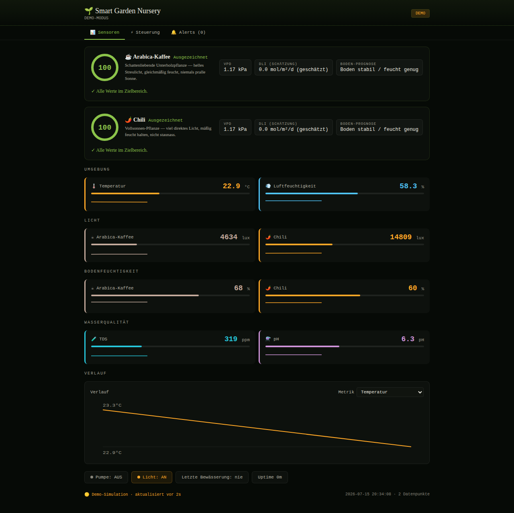

# Smart Garden Nursery

A plant health dashboard and automated watering system, **arabica coffee first**. Built
as a Vite + React dashboard with a plant-intelligence engine (health score, VPD/DLI,
soil-dry forecasting, plain-language recommendations) and a documented ESP32 firmware
contract, so the same UI runs fully in a demo simulation today and against real
hardware later by changing one config value.



## What it is

- **Arabica-first, multi-plant.** A tuned Coffea arabica profile (shade-loving
  understory plant — bright indirect light, consistently moist soil, slightly acidic
  water) plus a chili profile, in an architecture where adding another plant is a new
  entry in `src/plants/profiles.js`, not a rewrite.
- **Plant intelligence, not just thresholds** (`src/lib/health.js`): vapor pressure
  deficit (VPD), an estimated daily light integral (DLI), a soil-dry-out forecast
  (linear regression over recent readings), and a 0–100 health score with 1–2
  plain-language recommendations per plant.
- **Automated watering.** Each plant has a configurable, safety-gated auto-water rule
  (threshold %, pulse duration, cooldown, daily pulse cap). In live mode the ESP32 is
  the authoritative actor — it keeps enforcing the rule even with no browser open; in
  demo mode the dashboard simulates the identical decision logic
  (`shouldWater()`) so the loop (arm → dry soil → pulse → cooldown → re-arm) is
  visible without hardware.
- **A dashboard that behaves** — persists state across reloads, shows a connection
  badge instead of silently going stale, dedupes alerts on rising edge instead of
  flooding the log every poll, and keeps the original green-terminal aesthetic and
  German section labels.

## Running it

```bash
npm install
npm run dev
```

Opens in demo mode by default (`CONFIG.ESP32_URL = "demo"` in `src/config.js`) — no
hardware required. Simulated sensor data drifts over time, including soil drying out
so you can watch the auto-watering loop and alert log actually do something.

```bash
npm run build      # production build to dist/
npm run preview    # serve the production build locally
```

### Pointing at real hardware

Set `CONFIG.ESP32_URL` in `src/config.js` to the device's IP (e.g.
`"http://192.168.1.42"`) once the firmware (below) is flashed and on the network. The
dashboard polls `GET /api/sensors` on the same schema whether it's demo or live — see
[`docs/API.md`](docs/API.md) for the full contract.

## Project structure

```
src/
  main.jsx, App.jsx        # app shell + top-level state/poll loop
  config.js                 # ESP32_URL, poll interval, endpoints
  theme.js                  # color/font tokens (the green-terminal look, contrast-fixed)
  plants/profiles.js        # arabica + chili: thresholds, ideal bands, care copy
  lib/
    demoData.js              # plant-aware simulator emitting the live-identical schema
    alerts.js                # threshold checks + rising-edge dedupe
    health.js                # VPD, DLI, soil forecast, health score, shouldWater()
    storage.js               # localStorage helpers
    api.js                   # fetchSensors / sendCommand / config, timeout + error handling
  components/                # Header, Tabs, Gauge, Sparkline, TrendChart,
                              # PlantHealthCard, Controls, ProfileEditor,
                              # AutoWaterPanel, WateringHistory, Alerts, Toast, ...
firmware/smart_garden_esp32/ # Arduino sketch + wiring README
docs/API.md                  # endpoint + JSON contract (source of truth for both sides)
```

## Hardware

The firmware sketch (`firmware/smart_garden_esp32/smart_garden_esp32.ino`) targets an
ESP32 reading DHT22 (temp/humidity), two capacitive soil moisture sensors, two BH1750
lux sensors (one per plant zone), TDS + pH probes, and switching a pump relay and grow
light relay — serving the exact API the dashboard expects. See
`firmware/smart_garden_esp32/README.md` for the wiring table, library list, and
calibration steps, and `docs/API.md` for the request/response contract and the
auto-watering safety gates (max pulse duration, cooldown, daily cap, no-overlap).

The sketch has not been compiled against physical hardware as part of this change; it
has been reviewed for pin conflicts and logic sanity and is meant as a complete,
documented starting point.
